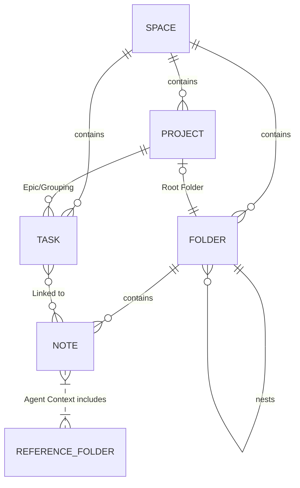

# Confluence/Jira Hybrid Architecture

## 1. The Space Concept (Top-Level Isolation)
A **Space** is the ultimate boundary. Everything (Folders, Notes, Projects, Tasks) belongs to a single Space (e.g., "Spirit Yachts", "Private").
- When you select a Space from the top-left dropdown, the entire app (Content sidebar, Task boards, Co-pilot context) filters down to *only* that Space.
- **Filesystem Mapping:** `storage/spaces/<space_name>/content/`

## 2. Content Area (Bespoke Confluence)
This is a flexible folder tree.
- **Flexible Hierarchy:** You can nest folders infinitely.
- **Project Designation:** You can right-click any folder and mark it as a "Project". This creates a Project record in the database linked to this folder. Any note inside this folder tree inherits this Project's context for the Co-pilot.
- **Reference Data Designation:** You can right-click a folder to mark it as "Reference Data". The Co-pilot will always include this folder's contents in its search/context for *any* chat within the current Space.

## 3. Tasks Area (Bespoke Jira)
Tasks are no longer just Markdown checklists; they are first-class database records.
- **Database Model:** A `Task` table in SQLite (`id`, `space_id`, `project_id`, `title`, `status`, `start_date`, `due_date`, `assignee`).
- **Linking:** A new join table `Task_Note_Links` allows you to link a Task to multiple Notes, and vice versa.
- **Views Engine:** Instead of hardcoded pages, we build a Views Engine. You can create a "Saved View" (e.g., "C7801 Kanban", "My Overdue Backlog", "All Projects Gantt"). A View is just a configuration of:
  - **Type:** Kanban, Backlog List, or Gantt
  - **Filters:** By Project(s), Assignee, Status

## 4. Agent Context (The Co-pilot)
When you open the Co-pilot, it determines its context dynamically:
1. **Current Space:** Reads the active Space.
2. **Current Location:** If you are reading a Note inside a Project folder, it injects that Project's metadata and linked Tasks into its prompt.
3. **Reference Data:** It automatically mounts the Space's designated Reference folders into its RAG (Retrieval-Augmented Generation) search pool.

## 5. Templates & Artifacts
- **Markdown Notes:** All notes are markdown artifacts created from templates.
- **Template Library:** A dedicated item at the very bottom of the sidebar tree (e.g., LIBRARY > Templates) will hold all markdown templates. When creating a new note in the Content area, the system will allow you to pick from these templates to scaffold the markdown artifact.
